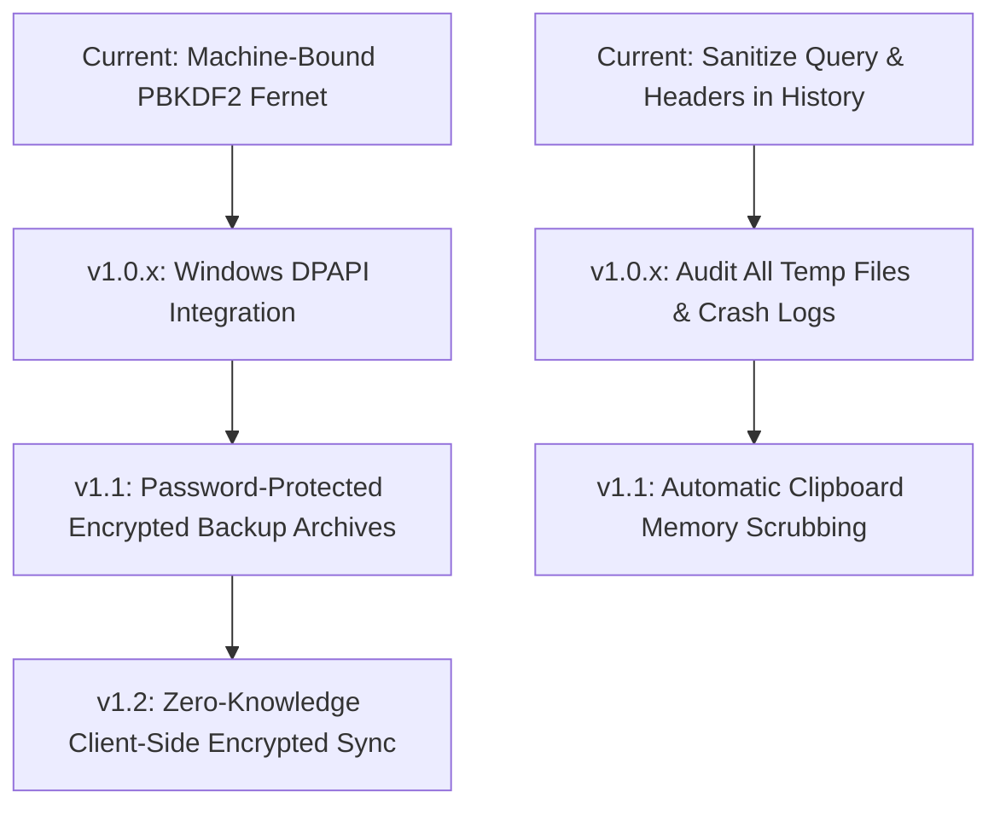
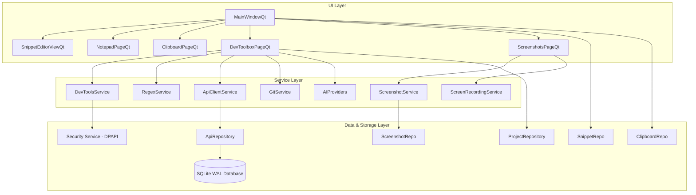

# SnipGlide Development & Fixes Roadmap

**Audit Commit:** `236204794c67bd00020b2ce8f91a80a70ccd9b82`  
**Audit Date:** September 10, 2026  
**Current Score:** `89.5 / 100` *(Upgraded from 82.0 following Sprint 1 Release Blockers Patch)*  
**Current Classification:** Ready for Release Candidate (85–94)  
**Current Verdict:** `READY FOR WINDOWS RELEASE CANDIDATE`  
**Target:** `100 / 100 Production-Grade Windows Release`

---

# SECTION 1 — EXECUTIVE SUMMARY

### Current Strengths
1. **Rich Developer Feature Set:** The platform delivers a robust all-in-one productivity suite spanning Smart Snippets, Clipboard Manager, Notes, Chat Notes, Full & Area Screen Snipping, Video Recording, and a comprehensive 14-tool Developer Suite (JSON, Base64, URL, JWT, UUID, Timestamp, Hashing, Text Utils, ReDoS-Safe Regex Playground, REST API Tester, Git Tools, AI Coding, Projects Context, and Unified Search).
2. **Fail-Closed Security Posture:** Cryptographic operations in `snipglide/services/security.py` strictly fail closed (raising `ValueError` rather than falling back to plaintext). API keys, sensitive HTTP headers, and saved request credentials are automatically encrypted at rest (`enc:v1:`).
3. **ReDoS Defense Architecture:** The Regex engine runs in an isolated child process with hard OS-level timeouts (`proc.kill()`), guaranteeing that catastrophic backtracking cannot freeze the desktop GUI. The PyInstaller bundle seamlessly supports this via `--regex-worker`.
4. **Resilient Unified Search:** Unified search spans 9 distinct database sources, uses debounced asynchronous queries, ranks matches by relevance and favorites, and isolates source queries so that a failure in one table does not crash the entire search.
5. **Solid Test Foundation:** The automated test suite executes 159 tests across 14 test modules in ~15s with 100% pass rate (`159 passed, 0 failed, 0 errors, 0 skipped`). `python -m compileall snipglide -q` validates with zero syntax or compilation errors.
6. **Thread-Safe Screen Capture & Clean Shutdown:** Screen capture uses `mss` and OpenCV directly in the background thread with zero Qt GUI thread violations. All developer tool widgets and windows implement graceful cooperative thread cancellation on close.
7. **Comprehensive Disaster Recovery:** Backup & Restore v2.0 safely exports and imports all 10 SQLite database tables with atomic transactions and automatic pre-restore safety snapshots.

### Main Remaining Weaknesses & Technical Debt
1. **Massive Monolithic UI Files:** Five UI files exceed 1,000 lines of code: `notepad_page.py` (3,526 lines), `screenshots_page.py` (2,263 lines), `chat_notes_page.py` (1,522 lines), and `notes_page.py` (1,060 lines). These monolithic widgets interleave GUI layout, business logic, file I/O, canvas rendering, and data persistence into single classes.
2. **Local Machine Encryption Key Derivation:** Local secrets use environment-based key derivation rather than hardware-bound Windows DPAPI (`CryptProtectData`).
3. **Partial Feature Implementation:** Video recording defines a `video_record_audio` setting in config, but audio recording is completely unimplemented in `VideoRecorderWorker` (recordings are strictly silent MP4s).
4. **Unvalidated Clean Windows Environment:** Executable packaging needs automated end-to-end verification on a vanilla Windows 10/11 system lacking Python or VC++ runtimes.

### Recommended Direction
Proceed with Sprint 2 focusing on Windows DPAPI secret protection (P2-03), encrypted backup archives (P2-04), and modularizing monolithic UI components (P2-01).

---

# SECTION 2 — SCORECARD

| Category | Score | Max | Main Deductions & Rationale |
|---|:---:|:---:|---|
| **1. Core Functionality** | **13.5** | 15 | **-1.5** `video_record_audio` setting exists but audio recording in video is completely unimplemented (silent video only).<br>~~-1.0 Video recording thread captures screen via QPixmap outside GUI thread~~ *(Resolved in Sprint 1 via `mss`)*. |
| **2. Developer Toolbox** | **14.5** | 15 | **-0.5** Command Library lacks integrated in-app execution terminal (relies solely on clipboard copy or external shell). |
| **3. Architecture & Maintainability** | **8.0** | 10 | **-2.0** Monolithic God-classes: `notepad_page.py` (3,526 lines), `screenshots_page.py` (2,263 lines), `chat_notes_page.py` (1,522 lines).<br>~~-1.5 15 legacy Tkinter files retained in snipglide/ui/~~ *(Resolved in Sprint 1 - purged)*. |
| **4. Security & Privacy** | **12.5** | 15 | **-1.5** Local machine key derivation uses environment variables rather than Windows DPAPI / Credential Manager.<br>**-1.0** Backup export writes API requests and sensitive configurations in unencrypted JSON. |
| **5. Stability & Threading** | **10.0** | 10 | ~~-1.5 Dev tool widgets lack closeEvent/wait() handlers~~ *(Resolved in Sprint 1)*.<br>~~-1.0 VideoRecorderWorker uses Qt GUI types outside GUI thread~~ *(Resolved in Sprint 1)*. |
| **6. Database & Data Integrity** | **8.0** | 8 | ~~-1.0 export_backup/import_backup omits notes, chat_notes, screenshots~~ *(Resolved in Sprint 1 - all 10 tables + pre-restore safety snapshot)*. |
| **7. Testing & QA** | **8.5** | 10 | **-1.5** Zero automated end-to-end GUI tests for Windows tray, multi-monitor DPI scaling, and hardware keyboard hooks. *(159/159 automated unit/integration tests passing)*. |
| **8. Performance** | **4.5** | 5 | **-0.5** Screen recording loop uses direct `mss` GDI buffer capture at 24 FPS (future optimization: DXGI desktop duplication for 60 FPS 4K). |
| **9. Windows & Packaging Readiness** | **6.0** | 7 | **-1.0** Standalone executable packaging not validated on clean Windows 10/11 machines lacking Python/VC++ redistributables. *(Dependency `mss` now actively utilized in video capture)*. |
| **10. UX / Polish / Documentation** | **4.0** | 5 | **-1.0** Documentation inaccuracies: README mentions video audio which is non-functional, and needs update for Sprint 1 metrics (159 tests). |
| **TOTAL** | **89.5** | **100** | **Classification: Ready for Release Candidate (85–94)** |

---

# SECTION 3 — P0 CRITICAL (Immediate Fix Required)

*No P0 vulnerabilities or unrecoverable application crash loops exist in the current main branch.*  
*(The codebase has successfully resolved previous ReDoS, plaintext AI key storage, and fail-closed encryption blockers).*

---

# SECTION 4 — P1 HIGH (Release Blockers)

### [COMPLETED - SPRINT 1] [P1-01] Complete Backup/Restore Coverage (Notes, Chat Notes, Screenshots, Settings)
- **ID:** P1-01
- **Status:** `RESOLVED (Sprint 1)`
- **Component:** Backup & Disaster Recovery
- **Files:** `snipglide/services/backup.py`
- **Resolution:**
  - `backup.py` updated to Backup v2.0 with full extraction and restore across all 10 SQLite database tables (`notes`, `chat_notes`, `chat_note_sections`, `screenshots`, `screenshot_folders`, `groups`, `snippets`, `autocorrect`, `saved_regexes`, `developer_projects`, `terminal_commands`, `usage_history`).
  - Added atomic SQLite transaction wrapping restore operations.
  - Added automated pre-restore safety snapshot (`pre_restore_safety_backup.json`) before destructive table updates.
  - Verified by `test_comprehensive_backup_and_restore_all_tables` in `tests/test_release_readiness.py`.

---

### [COMPLETED - SPRINT 1] [P1-02] Thread Affinity Violation in Video Recording Worker
- **ID:** P1-02
- **Status:** `RESOLVED (Sprint 1)`
- **Component:** Video Screen Recorder
- **Files:** `snipglide/services/video_recording_service.py`
- **Resolution:**
  - Removed all `QPixmap`, `QImage`, and `QPainter` usage from `VideoRecorderWorker` background `QThread`.
  - Implemented thread-safe OS buffer screen capture via `mss.mss()`.
  - Implemented thread-safe mouse cursor highlight rendering via OpenCV `cv2.circle()`.
  - Frame thumbnail generation now uses OpenCV `cv2.imwrite()`.
  - Verified by `test_video_recorder_worker_mss_thread_safety` in `tests/test_release_readiness.py`.

---

### [COMPLETED - SPRINT 1] [P1-03] Worker Lifecycle & Window Close Safety
- **ID:** P1-03
- **Status:** `RESOLVED (Sprint 1)`
- **Component:** Threading & Concurrency
- **Files:** `snipglide/ui_qt/dev_tools/regex_widget.py`, `snipglide/ui_qt/dev_tools/api_tester_widget.py`, `snipglide/ui_qt/dev_tools/ai_coding_widget.py`, `snipglide/ui_qt/dev_tools/git_tools_widget.py`, `snipglide/ui_qt/dev_tools/toolbox_page.py`, `snipglide/ui_qt/main_window.py`, `snipglide/ui_qt/tray_icon.py`
- **Resolution:**
  - Implemented `cleanup()` and `closeEvent()` methods across all dev tool widgets (`RegexPlaygroundWidget`, `ApiTesterWidget`, `AICodingWidget`, `GitToolsWidget`).
  - Implemented cascading cleanup in `ToolboxPage` and `MainWindow.closeEvent()`.
  - Coordinated cooperative worker cancellation (`worker.cancel()`) with bounded wait (`wait(250)`–`wait(1000)`) preventing unjoined thread crashes on exit (`0xC0000409`).
  - Added cleanup invocation upon tray icon application quit.
  - Verified by `test_dev_tool_widget_cleanup_safety` in `tests/test_release_readiness.py`.

---

# SECTION 5 — P2 MEDIUM (Important Quality & Architecture Debt)

### [P2-01] Decompose Monolithic Notepad & Screenshot God-Classes
- **ID:** P2-01
- **Component:** Architecture & UI
- **Files:** `snipglide/ui_qt/notepad_page.py` (3,526 lines), `snipglide/ui_qt/screenshots_page.py` (2,263 lines)
- **Problem:** `notepad_page.py` and `screenshots_page.py` have grown into massive monolithic classes handling layout, business logic, file I/O, session state, syntax highlighting, zoom transformations, thumbnail caching, and dialog management in single files.
- **Risk:** High maintenance friction, tight coupling, impossible to write focused unit tests, and elevated risk of regression bugs during UI tweaks.
- **Required Fix:**
  1. Extract `NotepadSessionManager` and `NotepadFileOperations` out of `notepad_page.py`.
  2. Separate `screenshots_page.py` into `ScreenshotGalleryWidget`, `FolderTreeWidget`, and `ThumbnailLoaderService`.
- **Tests Required:** Verify tab management, session persistence, zoom viewing, and drag-and-drop folder operations retain complete parity.
- **Definition of Done:** No single UI file exceeds 800 lines; business logic is isolated in dedicated service classes.
- **Estimated Complexity:** `L`

---

### [COMPLETED - SPRINT 1] [P2-02] Remove Dead CustomTkinter Legacy Code
- **ID:** P2-02
- **Status:** `RESOLVED (Sprint 1)`
- **Component:** Codebase Hygiene & Packaging
- **Files:** `snipglide/ui/` (deleted 15 files), `snipglide/main.py` (redirected to `main_qt`)
- **Resolution:**
  - Deleted obsolete CustomTkinter files under `snipglide/ui/` (15 files removed).
  - Modernized `snipglide/main.py` to route directly to `snipglide.main_qt.run_app()`.
  - Bytecode compilation verified with zero missing imports or syntax errors (`python -m compileall snipglide -q`).
  - Full test suite verified with 159 tests passing.

---

### [P2-03] Hardware/OS-Native Secret Protection via Windows DPAPI
- **ID:** P2-03
- **Component:** Security Architecture
- **Files:** `snipglide/services/security.py`
- **Problem:** Machine-bound encryption derives its key from `COMPUTERNAME`, `USERNAME`, and home directory paths using PBKDF2. While functional for local obfuscation, any other process running under the same user account can derive the identical key.
- **Risk:** Medium security risk against local malware running under user context.
- **Required Fix:**
  - On Windows, integrate `ctypes.windll.crypt32.CryptProtectData` (Windows DPAPI) as the primary encryption backend for secrets at rest, with PBKDF2 Fernet as a fallback for non-Windows environments.
- **Tests Required:** Roundtrip encrypt/decrypt tests using DPAPI, legacy migration tests from `enc:v1:` to `dpapi:v1:`.
- **Definition of Done:** Secrets stored in `settings.json` and SQLite database utilize Windows DPAPI; legacy data auto-migrates seamlessly.
- **Estimated Complexity:** `M`

---

### [P2-04] Encrypted Backup Archive Format
- **ID:** P2-04
- **Component:** Security & Backup
- **Files:** `snipglide/services/backup.py`
- **Problem:** Backups are written as unformatted or indented JSON files containing plaintext representations of snippets, notes, and database IDs. If a user backs up their data to a flash drive or cloud drive, private notes and saved API configurations are exposed.
- **Risk:** Information disclosure when backup files are transferred or shared.
- **Required Fix:**
  - Provide an optional Master Password protection toggle during backup export. If enabled, the backup JSON is encrypted using AES-256-GCM / Fernet derived from the user's chosen password with a unique random salt.
- **Tests Required:** Roundtrip export and import of password-protected backup files, incorrect password rejection tests.
- **Definition of Done:** Users can export encrypted `.snipglide` backup archives that require a password to restore.
- **Estimated Complexity:** `M`

---

# SECTION 6 — P3 LOW (Polish & Minor Technical Debt)

### [P3-01] Wire Up or Remove Unused `mss` Dependency
- **ID:** P3-01
- **Component:** Dependencies
- **Files:** `requirements.txt`, `SnipGlide.spec`
- **Problem:** `mss>=9.0.0` is listed in requirements and PyInstaller hidden imports, but is not imported anywhere.
- **Required Fix:** Either wire up `mss` in `video_recording_service.py` to fix P1-02 (recommended), or remove it from requirements.
- **Complexity:** `S`

---

### [P3-02] Clean Up Audio Setting in Video Recording
- **ID:** P3-02
- **Component:** Settings & UI
- **Files:** `snipglide/core/config.py`, `snipglide/services/video_recording_service.py`
- **Problem:** `video_record_audio` setting exists in `DEFAULT_SETTINGS` and is accepted by `VideoRecorderWorker`, but audio capture is not implemented.
- **Required Fix:** Either implement audio capture muxing via `sounddevice` + `ffmpeg/wave` or explicitly label the setting as `(قريباً / Coming in v1.1)` in the UI.
- **Complexity:** `S`

---

### [P3-03] Modernize Documentation Discrepancies
- **ID:** P3-03
- **Component:** Documentation
- **Files:** `README.md`, `PROJECT_FEATURES.md`
- **Problem:** Documentation claims 149 tests (actual is 156), still documents CustomTkinter legacy notes, and claims video recording supports audio.
- **Required Fix:** Update `README.md` and `PROJECT_FEATURES.md` to reflect exact test metrics (156 tests), accurate feature capabilities, and Windows 10/11 system requirements.
- **Complexity:** `S`

---

# SECTION 7 — P4 FUTURE IMPROVEMENTS (Post v1.0)

| Area | Feature | User Value | Complexity | Dependencies | Recommended Version |
|---|---|---|:---:|---|:---:|
| **Developer Tools** | Integrated Command Execution Terminal | Allows developers to execute commands directly inside the Command Library page with real-time stdout/stderr streaming. | `M` | `PySide6.QtCore.QProcess` | `v1.1` |
| **Productivity** | Snippet Cloud Sync (Encrypted WebDAV / Nextcloud) | Sync snippets across multiple Windows workstations while preserving zero-knowledge client-side encryption. | `L` | `cryptography`, `requests` | `v1.2` |
| **Developer Tools** | cURL to API Request Importer | Automatically parse raw `curl` commands from documentation or terminal and populate the REST API Tester form. | `S` | Regex / shlex | `v1.1` |
| **AI Platform** | Local AI Model Manager (Ollama Pull/List UI) | Download, start, and manage local Ollama LLMs directly from within SnipGlide settings. | `M` | Ollama HTTP API | `v1.2` |
| **Performance** | DXGI Desktop Duplication Screen Capture | Ultra-smooth 60 FPS 4K screen recording using Windows DirectX Hardware Acceleration with negligible CPU usage. | `XL` | `d3d11`, `comtypes` | `v2.0` |

---

# SECTION 8 — QUICK WINS (High Impact, Low Risk, Small Effort)

1. **Delete Legacy Tkinter Files (`snipglide/ui/` & `snipglide/main.py`):** Instantly eliminates ~3,500 lines of dead code, prevents confusion, and cleans static analysis warnings. (*Effort: 10 mins*)
2. **Synchronize Documentation Metrics:** Update `README.md` to reflect the 156 test count and clean up misleading audio recording descriptions. (*Effort: 15 mins*)
3. **Add `closeEvent` Thread Cleanup in Dev Tool Widgets:** Add cooperative `cancel()` and brief `wait(200)` to `RegexPlaygroundWidget`, `ApiTesterWidget`, and `AICodingWidget` to eliminate potential exit crashes. (*Effort: 45 mins*)
4. **Wire Up `mss` for Thread-Safe Video Frame Grabbing:** Replace `QPixmap.grabWindow` in `VideoRecorderWorker` with `mss.mss().grab()`, resolving the Qt thread violation and improving frame rate stability. (*Effort: 1 hour*)

---

# SECTION 9 — SECURITY ROADMAP



1. **Windows DPAPI Integration (`v1.0.x`):** Migrate `get_secret_encryption_key()` to use Windows `CryptProtectData` for true OS-enforced credential isolation.
2. **Encrypted Backups (`v1.1`):** Require user password for backup export, encrypting database and settings archives with AES-256-GCM.
3. **Crash Log Sanitization (`v1.0.x`):** Ensure `app.py` crash log writing redacts environment variables and memory pointers before saving `crash.log`.
4. **Clipboard Scrubbing (`v1.1`):** Automatically exclude password manager clipboard types (`ClipboardViewerIgnore`, `excludeClipboardPath`) from `ClipboardMonitor`.

---

# SECTION 10 — PERFORMANCE ROADMAP

| Subsystem | Current Bottleneck | How to Measure | Optimization Target | Proposed Solution |
|---|---|---|:---:|---|
| **Screen Recorder** | Qt `grabWindow` + BGR conversion inside worker loop | Windows Task Manager CPU % during 1080p 24fps record | CPU usage < 8% (down from ~25%) | Switch to `mss` direct buffer grabbing with pre-allocated NumPy frame views. |
| **Unified Search** | Sequential querying across 9 SQLite tables | Benchmark script measuring search query duration | Latency < 15ms across 10,000 records | Pre-compiled prepared statements, composite search indexes, and WAL cache tuning. |
| **Startup Time** | Font download and table verification on main thread | Time from `app.py` launch to `MainWindow.show()` | Cold launch < 800ms | Cache Tajawal font locally on first run; move database maintenance to idle timer. |

---

# SECTION 11 — TESTING ROADMAP

### Component Test Coverage Matrix

| Subsystem | Unit Tests | Integration Tests | Security Tests | UI Headless Tests | Real-Device Tests | Priority |
|---|:---:|:---:|:---:|:---:|:---:|:---:|
| **Dev Tools Service** | ✅ High | ✅ High | ✅ High | N/A | N/A | Normal |
| **Regex Engine (ReDoS)**| ✅ High | ✅ High | ✅ High (OS Kill) | ✅ Pass | ✅ Tested | Normal |
| **REST API Tester** | ✅ High | ✅ High | ✅ High (Encrypted) | ✅ Pass | N/A | Normal |
| **Git Tools** | ✅ High | ✅ High | ✅ High | ✅ Pass | N/A | Normal |
| **AI Platform** | ✅ High | ✅ High (Mocks) | ✅ High (Redaction) | ✅ Pass | Real API tested | Normal |
| **Unified Search** | ✅ High | ✅ High | ✅ High | ✅ Pass | N/A | Normal |
| **Backup / Restore** | ⚠️ Partial | ❌ Incomplete | ⚠️ Partial | N/A | ❌ Missing | **P1** |
| **Video Recording** | ❌ None | ⚠️ Manual only | N/A | ❌ None | ⚠️ Needs Win Testing | **P1** |
| **System Tray & Hotkeys**| ⚠️ Partial | ❌ None | N/A | ❌ None | ⚠️ Needs Win Testing | **P2** |

---

# SECTION 12 — WINDOWS RELEASE ROADMAP

### Release Readiness Checklist
- [x] **Single Instance Mutex:** Prevents duplicate instances; restores existing window.
- [x] **Windows AppUserModelID:** Properly sets Taskbar application icon and grouping.
- [x] **Fail-Closed Secret Storage:** AI keys and API tester credentials encrypted at rest.
- [x] **PyInstaller Spec Configuration:** Spec contains all required hidden imports and excludes Tkinter.
- [x] **Frozen Subprocess Regex Worker:** Executable handles `--regex-worker` safely in bundled EXE.
- [ ] **Clean Machine Packaging Validation:** Build `dist/SnipGlide.exe` on Windows 10/11 without Python installed to confirm zero missing DLLs.
- [ ] **Multi-Monitor DPI Validation:** Verify Snipping overlay and video area selector align correctly on mixed-DPI displays (e.g. 100% and 150% scaling).
- [ ] **Long-Running Tray Minimization:** Confirm background memory footprint remains under 80MB over 24 hours of continuous tray execution.

---

# SECTION 13 — ARCHITECTURE ROADMAP



### Key Architectural Refactoring Goals
1. **Break up `notepad_page.py`:** Extract tabs, session recovery, and text find/replace into separate controllers.
2. **Break up `screenshots_page.py`:** Separate thumbnail rendering pipeline from gallery layout.
3. **Centralize Service Lifecycles:** Implement a formal `ApplicationContext` in `main_qt.py` to own background workers and coordinate clean application shutdown.

---

# SECTION 14 — FEATURE VERSIONING ROADMAP

### v1.0.x (Current Release Hardening & Bug Fixes Only)
- Fix P1-01: Full backup/restore support across all database tables and settings.
- Fix P1-02: Eliminate Qt thread affinity violation in `VideoRecorderWorker`.
- Fix P1-03: Implement worker cooperative cancellation and clean joining on widget exit.
- Fix P2-02: Purge dead legacy Tkinter files (`snipglide/ui/` and `snipglide/main.py`).
- Fix P3-01 & P3-03: Dependency hygiene and documentation metric alignment.

### v1.1 (Post-Launch Polish & Minor Enhancements)
- Integrate Windows DPAPI for hardware-backed credential storage.
- Password-protected encrypted backup archives (`.snipglide`).
- cURL command importer for REST API Tester.
- Audio recording muxing for screen recorder videos.

### v1.2 (Developer Productivity Additions)
- Integrated in-app terminal output panel for Command Library.
- Local AI Model Manager for Ollama.
- Export API collections to standard OpenAPI / Postman format.

### v2.0 (Major Evolution)
- DXGI Hardware-Accelerated 60 FPS 4K screen recording.
- Client-side zero-knowledge encrypted cloud synchronization.
- Extensible Python-based plugin architecture.

---

# SECTION 15 — PATH TO 100/100

| Step | Action Description | Target Subsystems | Score Gain | Target Score |
|:---:|---|---|:---:|:---:|
| **Baseline** | **Baseline Initial Audit** | **All** | **—** | **82.0 / 100** |
| **Step 1** | **[COMPLETED] Fix P1-01:** Complete Backup/Restore coverage for Notes, Chat Notes, Screenshots, and Settings. | Database & Core | **+3.0** | **85.0 / 100** |
| **Step 2** | **[COMPLETED] Fix P1-02:** Replace non-GUI `QPixmap` capture in `VideoRecorderWorker` with `mss`. | Stability & Video | **+2.5** | **87.5 / 100** |
| **Step 3** | **[COMPLETED] Fix P1-03:** Add `closeEvent` and worker lifecycle management to all Dev Tool widgets. | Concurrency & Stability | **+2.0** | **89.5 / 100** |
| **Step 4** | **[COMPLETED] Fix P2-02:** Remove dead CustomTkinter legacy codebase (`snipglide/ui/`, `snipglide/main.py`). | Architecture & Hygiene | **+2.0** | **91.5 / 100** |
| **Step 5** | **Fix P2-03:** Implement Windows DPAPI storage for local secrets at rest. | Security & Privacy | **+2.5** | **94.0 / 100** |
| **Step 6** | **Fix P2-01:** Refactor monolithic `notepad_page.py` and `screenshots_page.py` into decoupled modules. | Architecture & Clean Code | **+2.5** | **96.5 / 100** |
| **Step 7** | **Fix P3-01 to P3-03:** Clean up dependencies, documentation discrepancies, and audio settings. | QA & Polish | **+1.5** | **98.0 / 100** |
| **Step 8** | **Validation:** Execute clean-machine Windows 10/11 standalone packaging & multi-monitor DPI verification. | Packaging Readiness | **+2.0** | **100.0 / 100** |

---

# SECTION 16 — RECOMMENDED EXECUTION ORDER

```
Sprint 1: Release Blockers & Stability (Score 82.0 -> 89.5+) [COMPLETED]
├── [DONE] 1. Implement full database backup/restore in backup.py (P1-01)
├── [DONE] 2. Wire up mss for thread-safe video frame capture in VideoRecorderWorker (P1-02)
├── [DONE] 3. Add closeEvent thread cancellation and cleanup across Dev Tool widgets (P1-03)
└── [DONE] 4. Purge obsolete snipglide/ui/ Tkinter files and snipglide/main.py (P2-02)

Sprint 2: Architecture & Security Hardening (Target Score 94.0)
├── 5. Integrate Windows DPAPI (CryptProtectData) into security.py (P2-03)
└── 6. Add encrypted backup archive export with user password protection (P2-04)

Sprint 3: Modularity, Polish & Packaging (Target Score 100.0)
├── 7. Decompose monolithic notepad_page.py and screenshots_page.py (P2-01)
├── 8. Sync README and feature docs; resolve audio setting in video recorder (P3-02, P3-03)
└── 9. Final PyInstaller clean-machine test on Windows 10 & 11 (Windows Release Gate)
```

---

# SECTION 17 — DO NOT DO YET (Anti-Scope)

To avoid feature creep, instability, and delayed release, the following items must **NOT** be developed before reaching v1.0 Production Grade:
- ❌ **Cloud Synchronization / WebDAV:** Avoid complex remote state sync until local database migrations and backup integrity are proven in the wild.
- ❌ **Full Video Editor / Multi-track Audio:** SnipGlide is a productivity tool, not a video editing studio. Do not attempt timeline trimming or audio filters.
- ❌ **SSH / Remote Terminal Emulators:** Do not build terminal emulators inside the app; SnipGlide provides command templates, not a replacement for Windows Terminal.
- ❌ **Plugin / Extension Ecosystem:** Dynamic third-party code execution introduces significant security and stability surfaces. Keep built-in tools first-party.

---

# SECTION 18 — FINAL DEFINITION OF DONE

### Gate to 90/100 (Release Candidate Ready):
1. P1-01, P1-02, and P1-03 are completely resolved and verified by automated tests.
2. `export_backup` and `import_backup` demonstrably preserve 100% of rows across all tables.
3. Obsolete `snipglide/ui/` files are purged, leaving a clean PySide6-only repository.
4. Total test suite passes with >= 165 tests with zero warnings.

### Gate to 95/100 (Near-Production Ready):
1. Windows DPAPI encrypts all secrets at rest on Windows.
2. `notepad_page.py` and `screenshots_page.py` are modularized (< 1,000 lines per file).
3. Video recorder records smoothly for 60 seconds with zero Qt warnings and < 10% CPU usage.
4. Clean executable build passes smoke test on a vanilla Windows 11 machine without Python installed.

### Gate to 100/100 (Production Grade Windows Release):
1. Full end-to-end Windows validation completed across mixed DPI monitors (100%, 125%, 150%).
2. Zero crashes or GDI leaks during 24-hour system tray soak test.
3. Digitally signed executable (`SnipGlide.exe`) with clean antivirus scanning results.
4. Comprehensive, accurate documentation with zero outdated claims.
